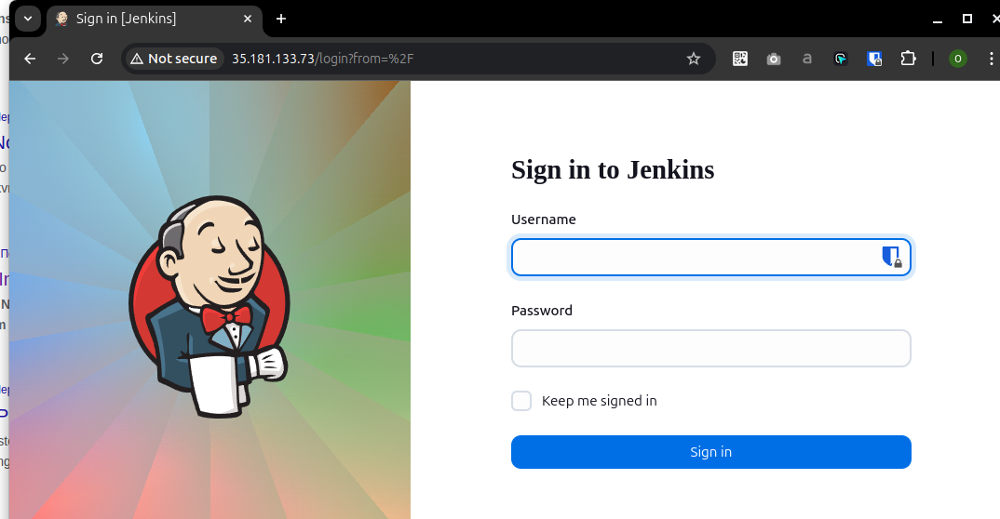
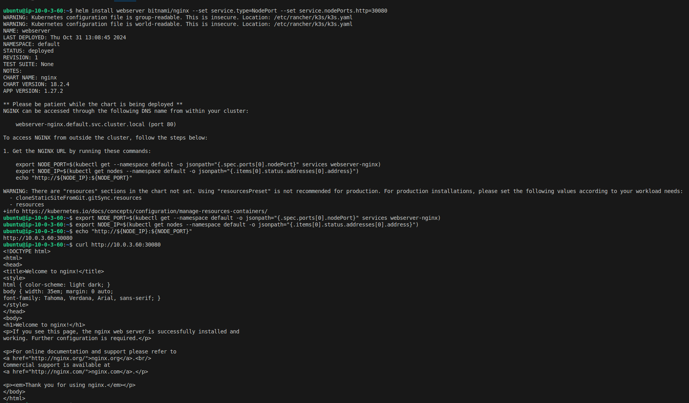
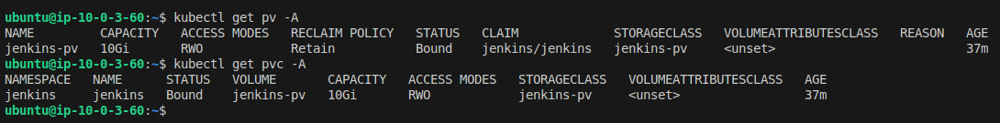
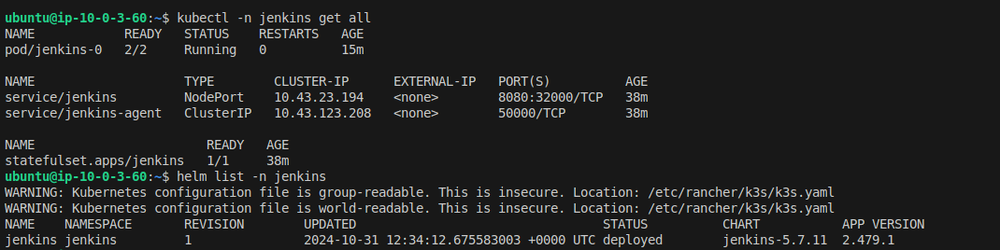
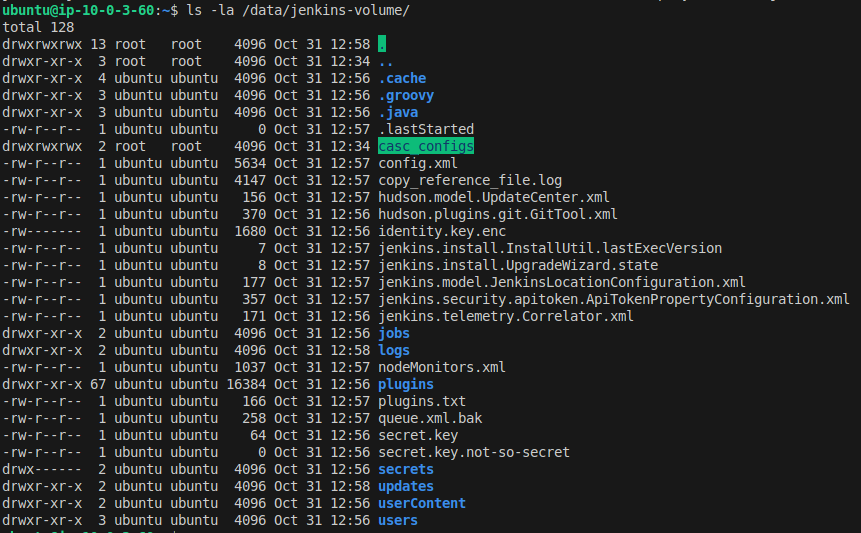
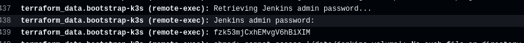

# Task 4: Jenkins Installation and Configuration

## Submission

- Provide a PR with the Helm chart for Jenkins deployment in a new repository. (done)
- Ensure that Jenkins is accessible via intenet. 

- Provide a screenshot of the Jenkins freestyle project log showing "Hello world".

- Provide a PR with the GHA pipeline code for Jenkins deployment. (done)
- Document the authentication and security configurations in a README file. (Authentication and security configurations you will find in GHA output.)

## Evaluation

1. **Helm Installation and Verification (10 points)**

   - Helm is installed and verified by deploying the Nginx chart.

2. **Cluster Requirements (10 points)**

   - The cluster has a solution for managing persistent volumes (PV) and persistent volume claims (PVC).

3. **Jenkins Installation (50 points)**

   - Jenkins is installed using Helm in a separate namespace.
   - Jenkins is available from the internet.

4. **Jenkins Configuration (10 points)**

   - Jenkins configuration is stored on a persistent volume and is not lost when Jenkins' pod is terminated.

5. **Verification (10 points)**

   - A simple Jenkins freestyle project is created and runs successfully, writing "Hello world" into the log.

6. **Additional Tasks (10 points)**
   - **GitHub Actions (GHA) Pipeline (5 points)**
     - A GHA pipeline is set up to deploy Jenkins.

   - **Authentication and Security (5 points)**
     - Authentication and security settings are configured for Jenkins.
     