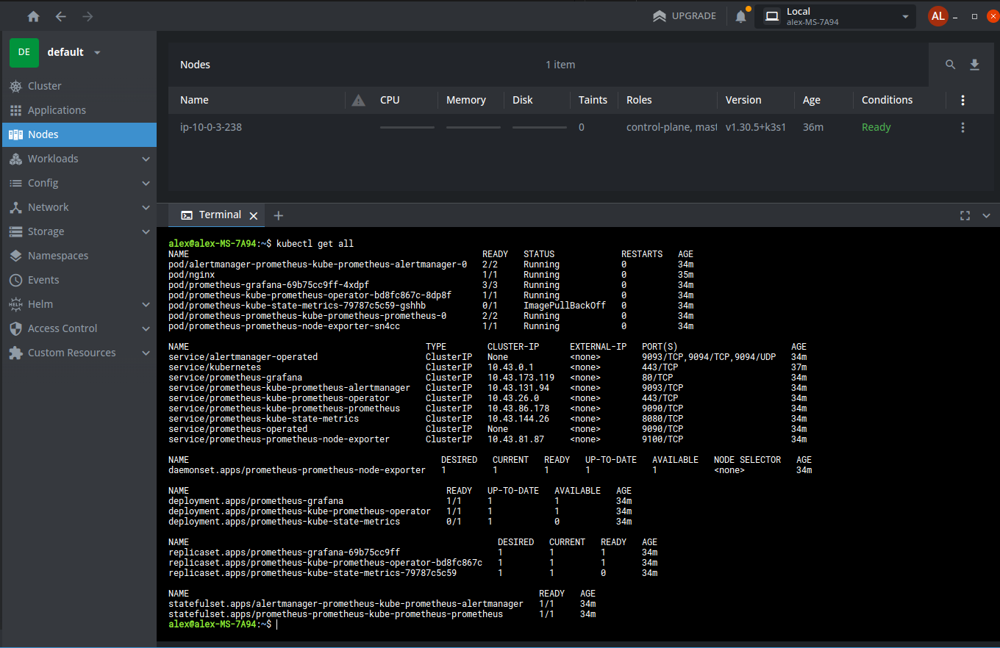
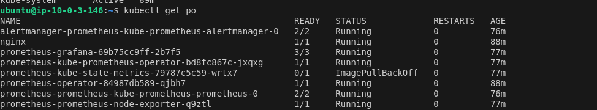

# Submission: Terraform Code for K8s Cluster and Bastion Host

## Terraform Code
You can find the Terraform configuration for setting up the Kubernetes (K8s) cluster and the bastion host in the following file:

[View the code here](main.tf)

---

## K8s Cluster Verification

### Cluster is accesible from local machine

### Node Status
The following screenshot shows the result of the `kubectl get nodes` command, verifying that the Kubernetes cluster is up and running:

---

## Workload Deployment

The simple workload has been successfully deployed and is running on the Kubernetes cluster. Below is a screenshot that confirms the deployment status:

---

## Monitoring Setup

Monitoring has been configured for the cluster. Here's a screenshot of the monitoring setup in action:

