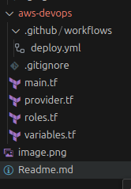

```bash
$ terraform version
Terraform v1.9.6
on linux_amd64

$ aws --version
aws-cli/2.17.57 Python/3.12.6 Linux/6.8.0-45-generic exe/x86_64.ubuntu.24
```

Provide a screenshot of the non-root account secured by MFA (ensure sensitive information is not shared).


Terraform code is created and includes:
A bucket for Terraform states
[main.tf](main.tf)


IAM role with correct Identity-based and Trust policies
[roles.tf](roles.tf)

Workflow includes all jobs

[workflows](.github/workflows/deploy.yml)


Variables are defined in a separate variables file.
[variables.tf](variables.tf)

Resources are separated into different files for better organization.



Terraform plan is executed successfully for GithubActionsRole


A GitHub Actions (GHA) pipeline is passing

